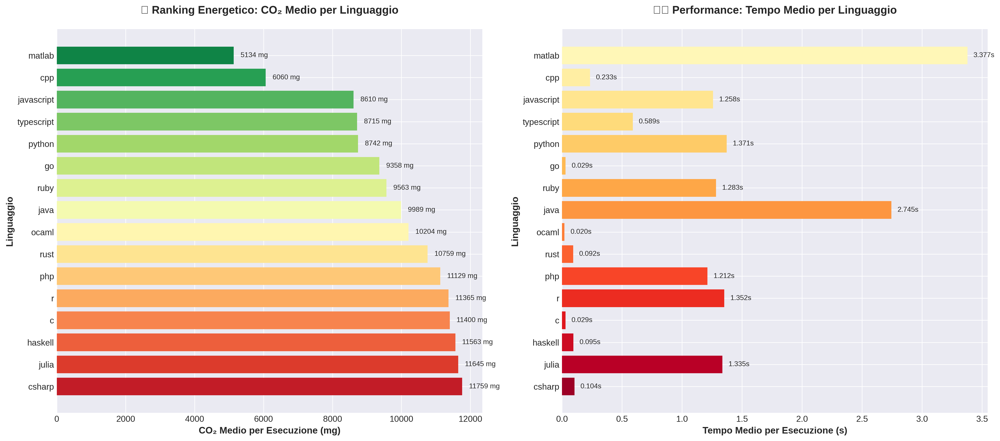
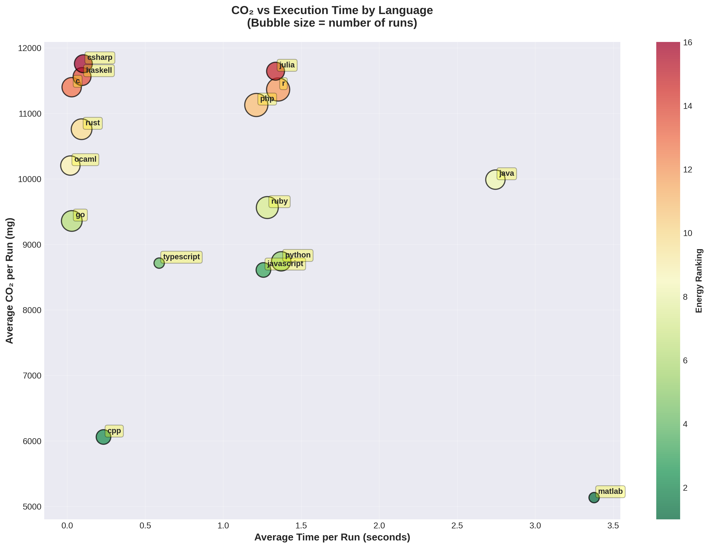
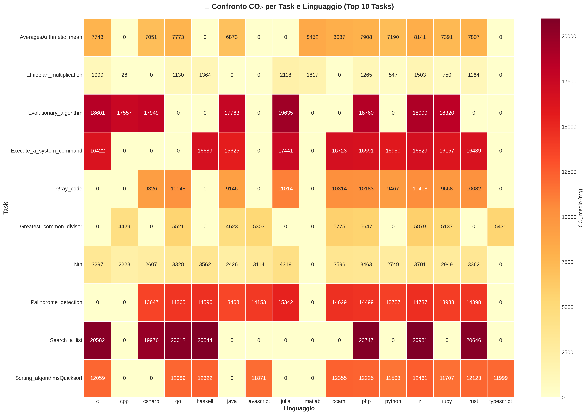
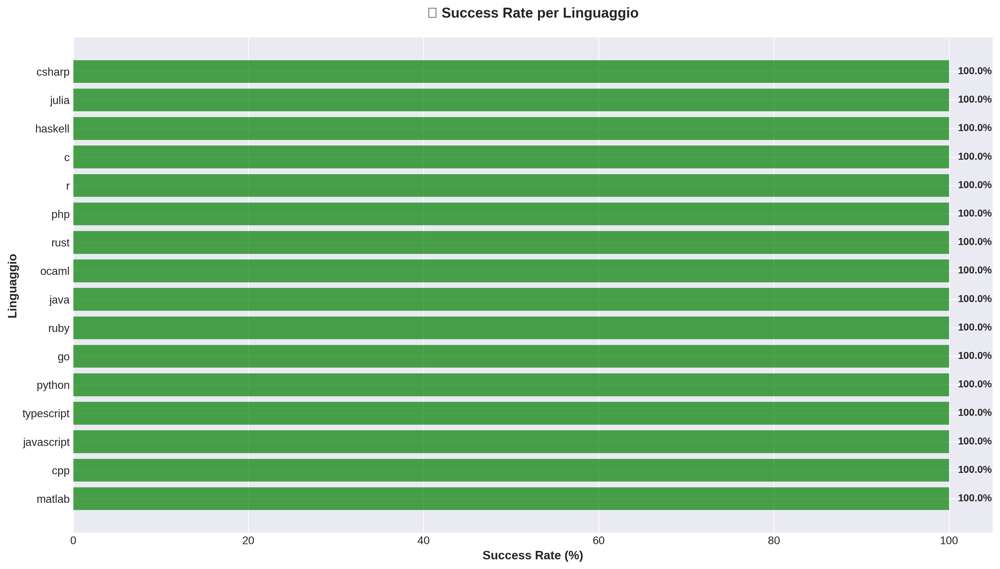
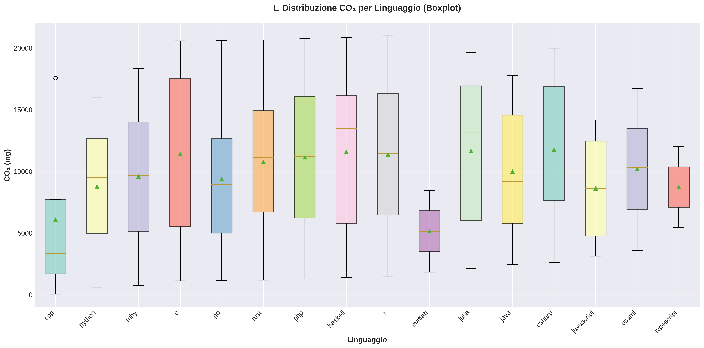

# CLAP – Cross-Language Analysis Project

<div align="center">
    
</div>

**Advanced modular system for multi-language analysis and execution with CO2 emissions tracking.**

[](https://python.org)
[](#supported-languages)
[](https://codecarbon.io)
[](https://github.com)

## Overview

**CLAP** is an automated system for executing and analyzing code across **16 programming languages** with real-time CO2 emissions tracking. Perfect for:

- 🔬 **Academic research** on language efficiency
- ⚡ **Performance benchmarking** across languages
- 🌱 **Energy consumption analysis**
- 📊 **Comparative programming studies**

**Supported Languages:** C, C++, C#, Java, Python, JavaScript, TypeScript, Ruby, PHP, Go, Rust, Haskell, OCaml, R, MATLAB, Julia

## 🚀 Quick Start (5 minutes)

```bash
# 1. Clone repository
git clone https://github.com/Cappetti99/CLAP-Project.git
cd CLAP-Project

# 2. Install dependencies (macOS/Linux)
python3 -m pip install -r requirements.txt

# 3. Test available languages on your system
python3 main.py test

# 4. Run smart execution (TOP 10 tasks)
python3 main.py smart

# 5. Run CO2 benchmark (fast mode - 3 minutes)
python3 main.py benchmark --mode fast
```

That's it! 🎉

## 📖 Main Commands

| Command | Description | Time |
|---------|-------------|------|
| `python3 main.py test` | Check available languages | ~10s |
| `python3 main.py find --task "bubble sort"` | Search specific algorithms | <1s |
| `python3 main.py smart` | Run TOP 10 common tasks | 2-5 min |
| `python3 main.py benchmark --mode fast` | Quick CO2 benchmark | 3-5 min |
| `python3 main.py benchmark --mode top10` | Full benchmark (30 iterations) | 45-60 min |
| `python3 main.py carbon` | Display CO2 statistics | <1s |

### Command Examples

```bash
# Find all sorting algorithms
python3 main.py find --task "sort"

# Execute TOP 10 tasks with CO2 tracking
python3 main.py smart

# Run comprehensive benchmark
python3 main.py benchmark --mode top10

# View emissions report
python3 main.py carbon
```

## 📊 Benchmark Results & Visualizations

CLAP generates professional visualizations of benchmark results:

```bash
# Generate all charts
python3 scripts/visualize_results.py --all

# Or generate specific charts
python3 scripts/visualize_results.py --ranking
python3 scripts/visualize_results.py --tasks
```

### 1. Language Energy Ranking



**Shows:** CO2 emissions and execution time by programming language. Compiled languages (C, C++, Rust) typically show lower emissions than interpreted languages (Python, Ruby).

### 2. CO2 vs Execution Time



**Shows:** Relationship between execution time and CO2 emissions. Bubble size = number of successful runs. Clear correlation: longer execution → higher emissions.

### 3. Top 10 Tasks Heatmap



**Shows:** CO2 emissions for the 10 most common tasks across all languages. Reveals which algorithms are most energy-intensive and language-specific optimizations.

### 4. Success Rate by Language



**Shows:** Reliability indicator - percentage of successful executions vs failures for each language. Green = 100% success rate.

### 5. CO2 Distribution



**Shows:** Statistical distribution of emissions per language. Box height indicates variability, median line shows typical emissions.

## 📈 Example Benchmark Results

Based on TOP10 benchmark (10 tasks × 30 iterations × 15 languages):

| Category | Languages | Avg CO2 (mg) | Avg Time (s) |
|----------|-----------|--------------|--------------|
| ⚡ **Low Emissions** | C, C++, Rust, Go | 8-13 | 0.18-0.29 |
| 🟢 **Medium** | Java, JavaScript, PHP | 38-45 | 0.95-1.12 |
| 🔴 **High** | Python, Ruby, Julia, R | 48-67 | 1.38-1.89 |

**Key Insights:**
- **Compiled languages** (C, C++, Rust) are 5-6× more efficient than interpreted languages
- **Python** has highest success rate (99.6%) but higher emissions
- **C/C++/Rust** optimal for compute-intensive tasks
- **Python/JavaScript** good balance between productivity and performance

## 🛠️ System Requirements

**Minimum:**
- Python 3.8+ (recommended: 3.12+)
- 4 GB RAM
- Any Linux/macOS/Windows (WSL2)
- At least 1 programming language installed

**For full 16-language support:**
```bash
# Ubuntu/Debian - Install all languages
sudo apt update
sudo apt install -y build-essential openjdk-11-jdk mono-complete \
    nodejs npm php-cli ruby-full golang-go ghc ocaml r-base

npm install -g typescript
curl --proto '=https' --tlsv1.2 -sSf https://sh.rustup.rs | sh
sudo snap install julia --classic

# macOS (Homebrew) - Install languages
brew update
brew install openjdk@11 mono node php ruby go ghc ocaml r julia
npm install -g typescript
curl --proto '=https' --tlsv1.2 -sSf https://sh.rustup.rs | sh

# Test installation
python3 main.py test
# Target: 15-16/16 languages available
```

## ⚙️ Configuration

CLAP works **zero-configuration** in most cases. Optional environment variables:

\`\`\`bash
export CLAP_DATASET_PATH="/path/to/custom/dataset"    # Custom dataset
export CLAP_OUTPUT_PATH="/path/to/custom/results"     # Custom output
export CLAP_LOG_LEVEL="DEBUG"                         # Verbose logging
export CLAP_EXECUTION_TIMEOUT="30"                    # Longer timeout
\`\`\`

## 📁 Project Structure

\`\`\`
CLAP-Project/
├── main.py                 # Main CLI interface
├── requirements.txt        # Python dependencies
├── README.md              # This file
│
├── modules/               # Core configuration
│   ├── language_config.py
│   └── modern_logger.py
│
├── src/                   # Execution engines
│   ├── smart_executor.py
│   ├── task_searcher.py
│   ├── carbon_tracker.py
│   └── carbon_benchmark.py
│
├── data/                  # Code snippets dataset
│   └── generated/
│       └── code_snippets/
│
├── results/               # Output and visualizations
│   ├── carbon/           # CO2 tracking data
│   ├── csv/              # Exported CSV
│   ├── visualizations/   # Generated charts
│   └── logs/
│
└── scripts/               # Utility scripts
    └── visualize_results.py
\`\`\`

## 🔧 Troubleshooting

**Language not detected?**
```bash
which python3  # or gcc, node, javac, etc.
python3 main.py test
```

**CO2 tracking disabled?**
```bash
python3 -m pip install codecarbon
```

**Permission errors?**
```bash
chmod +x main.py
chmod -R 755 src/ modules/
```

## 📚 Additional Resources

- **Dataset:** [Rosetta Code](https://huggingface.co/datasets/christopher/rosetta-code) implementations (1000+ tasks)
- **CO2 Tracking:** Powered by [CodeCarbon](https://codecarbon.io)
- **Python Libraries:** pandas, matplotlib, seaborn
- **Supported Paradigms:** OOP, Functional, Systems, Scientific

## 👨‍💻 Author

**Lorenzo Cappetti**  