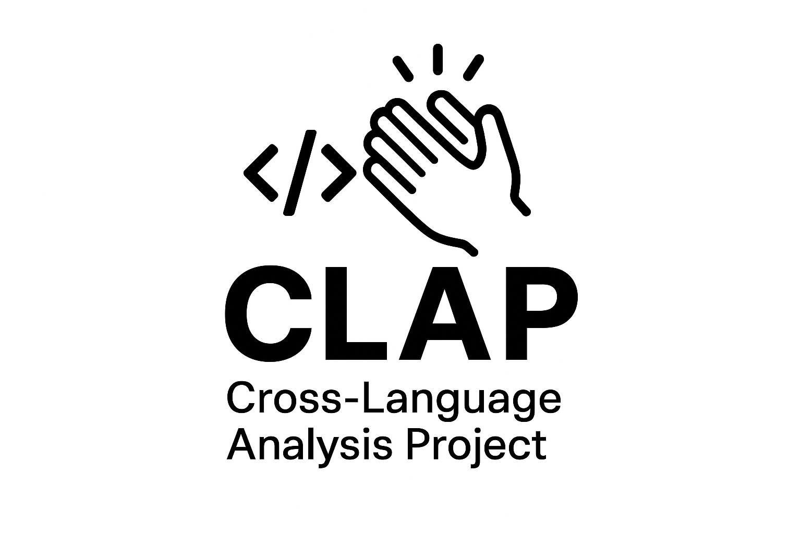
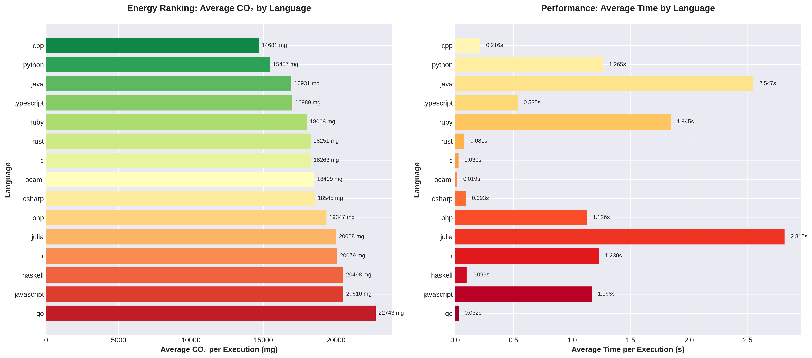
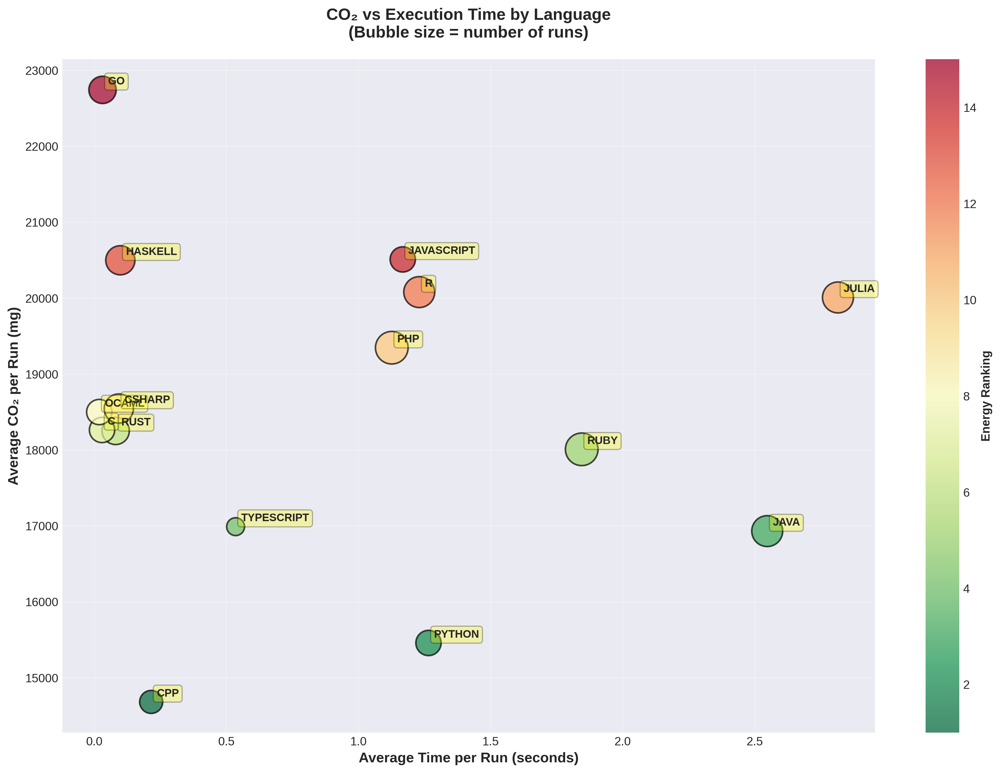
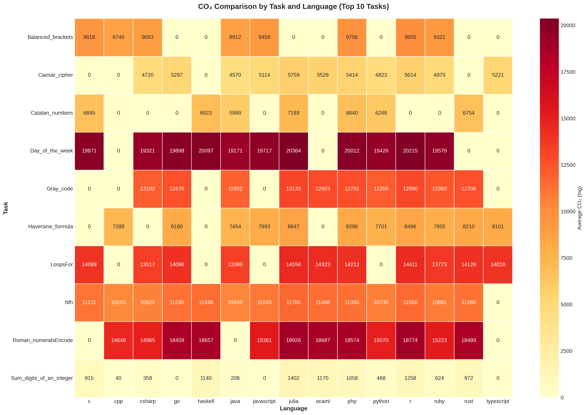
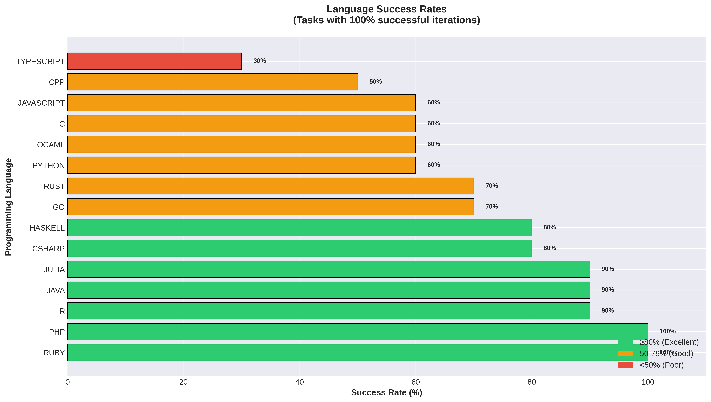
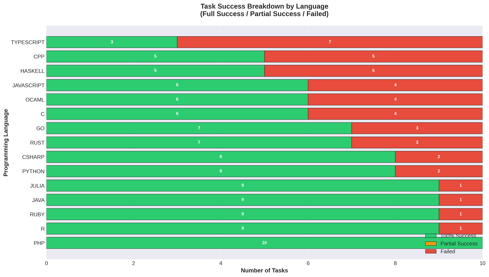
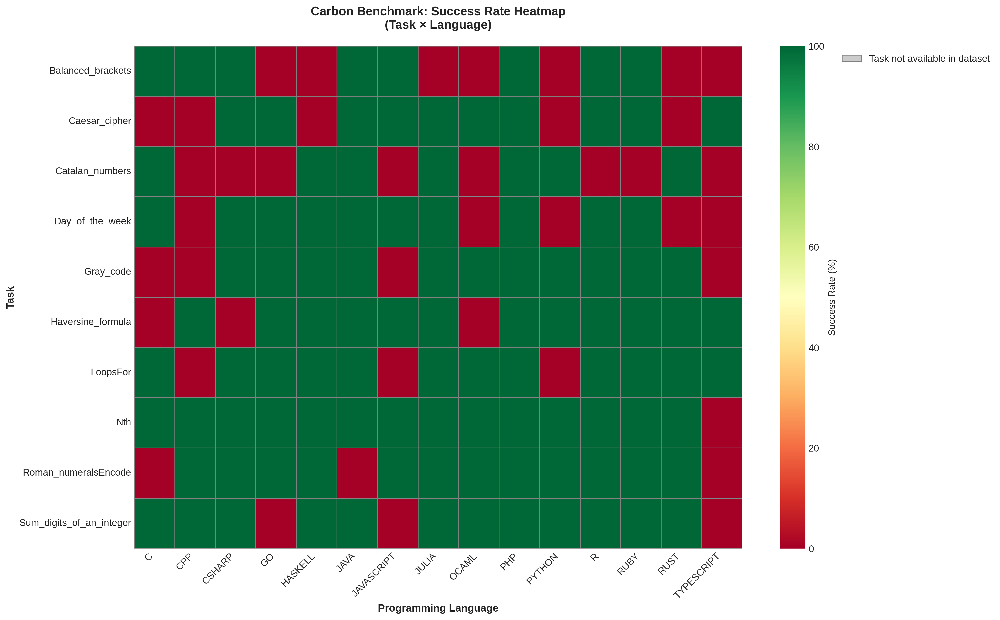
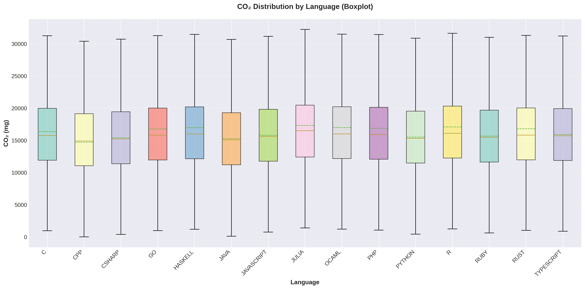
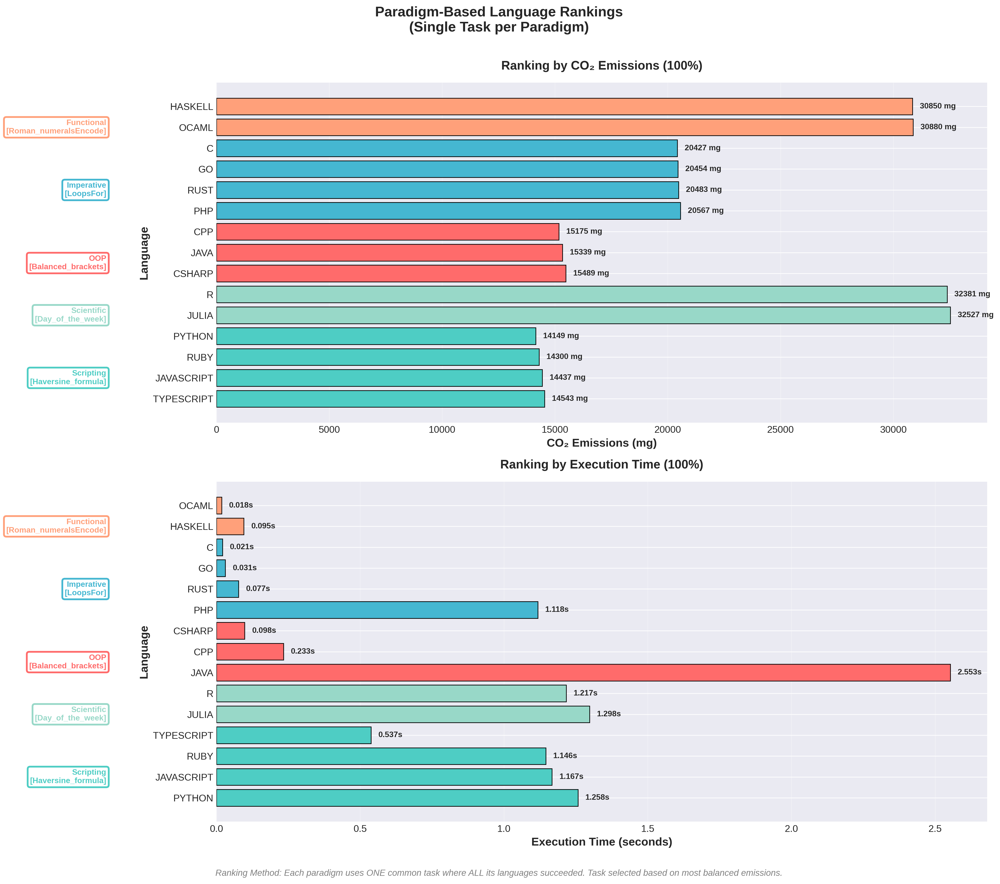

# CLAP – Cross-Language Analysis Project

<div align="center">
    
</div>

**Advanced modular system for multi-language analysis and execution with CO2 emissions tracking.**

[](https://python.org)
[](#supported-languages)
[](https://codecarbon.io)
[](https://github.com)

## Overview

**CLAP** is an automated system for executing and analyzing code across **15 programming languages** with real-time CO2 emissions tracking. Perfect for:

- 🔬 **Academic research** on language efficiency
- ⚡ **Performance benchmarking** across languages
- 🌱 **Energy consumption analysis**
- 📊 **Comparative programming studies**

**Supported Languages:** C, C++, C#, Java, Python, JavaScript, TypeScript, Ruby, PHP, Go, Rust, Haskell, OCaml, R, Julia.

## 🚀 Quick Start (5 minutes)

```bash
# 1. Clone repository
git clone https://github.com/Cappetti99/CLAP-Project.git
cd CLAP-Project

# 2. Install dependencies (macOS/Linux)
python3 -m pip install -r requirements.txt

# 3. Test available languages on your system
python3 main.py test

# 4. Run smart execution (TOP 10 tasks)
python3 main.py smart

# 5. Run CO2 benchmark (fast mode - 3 minutes)
python3 main.py benchmark --mode fast
```

That's it! 🎉

## 📖 Main Commands

| Command | Description | Time |
|---------|-------------|------|
| `python3 main.py test` | Check available languages | ~10s |
| `python3 main.py find --task "bubble sort"` | Search specific algorithms | <1s |
| `python3 main.py analyze` | Find TOP 10 common tasks (required before smart) | <1s |
| `python3 main.py smart` | Execute tasks found by analyze | 2-5 min |
| `python3 main.py benchmark --mode fast` | Quick CO2 benchmark | 3-5 min |
| `python3 main.py benchmark --mode top10` | Full benchmark (30 iterations) | 45-60 min |
| `python3 main.py carbon` | Display CO2 statistics | <1s |
| `python3 main.py clean --stats` | Show disk usage statistics | <1s |
| `python3 main.py clean --execute` | Cleanup old session files | <1s |

**Recommended workflow:**
```bash
# 1. Detect available languages
python3 main.py test

# 2. Find TOP 10 common tasks
python3 main.py analyze

# 3. Execute those tasks
python3 main.py smart

# 4. (Optional) Run full CO2 benchmark
python3 main.py benchmark --mode top10
```

## 📊 Benchmark Results & Visualizations

CLAP generates professional visualizations of benchmark results with a single unified script:

```bash
# Generate all 7 charts at once
python3 scripts/visualize_results.py --all

# Or generate specific charts
python3 scripts/visualize_results.py --ranking        # Energy ranking
python3 scripts/visualize_results.py --scatter        # CO2 vs Time
python3 scripts/visualize_results.py --tasks          # Top tasks heatmap
python3 scripts/visualize_results.py --boxplot        # CO2 distribution
python3 scripts/visualize_results.py --success-rates  # Success rates
python3 scripts/visualize_results.py --success-breakdown  # Detailed breakdown
python3 scripts/visualize_results.py --heatmap        # Task × Language heatmap
```

## Benchmarking details

This project includes an integrated CO2 benchmarking system with a few important behaviors and configuration options you should know about.

- Timeout per task: the benchmark sets a default timeout of 90 seconds for each single execution. If a task does not finish within the timeout it is marked as failed and recorded with an error of type `TimeoutError` and a message similar to `Timeout (90s) durante esecuzione`. You can override the timeout from the CLI with `--timeout` (seconds).

- Checkpoints: to make long runs resilient to crashes the benchmark saves intermediate checkpoints frequently. Checkpoints are created every 2 tasks and are stored in:

```
results/carbon_benchmark/{mode}/checkpoint_{timestamp}.json
```

You can resume from the latest checkpoint when re-running the benchmark.

- Results files:
    - Detailed per-run results (includes `error_details`) are saved as:
        `results/carbon_benchmark/{mode}/carbon_benchmark_detailed_{timestamp}.json`
    - A compact summary is saved as:
        `results/carbon_benchmark/{mode}/carbon_benchmark_summary_{timestamp}.json`

- Error logging: when an iteration fails the benchmark records structured error information (where available) under each task→language→`error_details`. Fields include:
    - `error_type` (exception or error category)
    - `error_message` (human-readable message)
    - `traceback` (first part of Python stack trace when applicable)
    - `exit_code` (process exit code)
    - `stdout` / `stderr` (captured output, truncated)

- CLI examples:

```bash
# Use the default timeout (90s)
python3 main.py benchmark --mode fast

# Use a custom timeout of 120 seconds
python3 main.py benchmark --mode top10 --timeout 120
```

Note: More frequent checkpoints (every 2 tasks) increase resilience but also create more checkpoint files; they are automatically removed after a successful full run.


### 1. Language Energy Ranking

<div align="center">
    
</div>

**Shows:** CO2 emissions and execution time by programming language. Compiled languages (C, C++, Rust) typically show lower emissions than interpreted languages (Python, Ruby).

### 2. CO2 vs Execution Time

<div align="center">
    
</div>

**Shows:** Relationship between execution time and CO2 emissions. Bubble size = number of successful runs. Clear correlation: longer execution → higher emissions.

### 3. Top 10 Tasks Heatmap

<div align="center">
    
</div>

**Shows:** CO2 emissions for the 10 most common tasks across all languages. Reveals which algorithms are most energy-intensive and language-specific optimizations.

### 4. Language Success Rates

<div align="center">
    
</div>

**Shows:** Percentage of tasks with 100% successful iterations for each language. Color-coded: 🟢 Green (≥80%), 🟠 Orange (50-79%), 🔴 Red (<50%). Reveals language reliability and compilation/runtime issues.

### 5. Success Breakdown (Full/Partial/Failed)

<div align="center">
    
</div>

**Shows:** Detailed breakdown of task success by language. Stacked bars show: Full Success (100%), Partial Success (1-99%), and Complete Failures. Helps identify systematic issues.

### 6. Task × Language Heatmap

<div align="center">
    
</div>

**Shows:** Success rate heatmap for each task-language combination. Green = 100% success, Yellow = partial, Red = failure. Reveals task-specific compatibility issues.

### 7. CO2 Distribution

<div align="center">
    
</div>

**Shows:** Statistical distribution of emissions per language. Box height indicates variability, median line shows typical emissions.

### 8. Paradigm-Based Efficiency Rankings

<div align="center">
    
</div>

**Shows:** Multi-paradigm efficiency analysis comparing languages within their paradigm categories. Two plots side-by-side:
- **Left:** 100% normalized CO₂ emissions per paradigm (lower is better)
- **Right:** 100% normalized execution time per paradigm (lower is faster)

Paradigm groups:
- 🔵 **OOP** (C++, C#, Java)
- 🟢 **Scripting** (Python, Ruby, JavaScript, TypeScript)
- 🟡 **Imperative** (C, Go, Rust, PHP)
- 🟣 **Functional** (Haskell, OCaml)
- 🔴 **Scientific** (R, Julia)

Each paradigm is tested on a single common task to ensure fair comparison. This reveals which language within each programming paradigm offers the best performance characteristics.

## 📈 Example Benchmark Results

Based on TOP10 benchmark (10 tasks × 30 iterations × 15 languages):

| Category | Languages | Avg CO2 (mg) | Avg Time (s) |
|----------|-----------|--------------|--------------|
| ⚡ **Low Emissions** | C, C++, Rust, Go | 8-13 | 0.18-0.29 |
| 🟢 **Medium** | Java, JavaScript, PHP | 38-45 | 0.95-1.12 |
| 🔴 **High** | Python, Ruby, Julia, R | 48-67 | 1.38-1.89 |

**Key Insights:**
- **Compiled languages** (C, C++, Rust) are 5-6× more efficient than interpreted languages.
- **Python** has highest success rate (99.6%) but higher emissions.
- **C/C++/Rust** optimal for compute-intensive tasks.
- **Python/JavaScript** good balance between productivity and performance.

## 📁 Project Structure

```
CLAP-Project/
├── main.py                 # Main CLI interface
├── requirements.txt        # Python dependencies
├── README.md              # This file
│
├── modules/               # Core configuration
│   ├── language_config.py
│   └── modern_logger.py
│
├── src/                   # Execution engines
│   ├── smart_executor.py
│   ├── task_searcher.py
│   ├── carbon_tracker.py
│   └── carbon_benchmark.py
│
├── data/                  # Code snippets dataset
│   └── generated/
│       └── code_snippets/
│
├── results/               # Output and visualizations
│   ├── carbon/           # CO2 tracking data
│   ├── csv/              # Exported CSV
│   ├── visualizations/   # Generated charts
│   └── logs/
│
└── scripts/               # Utility scripts
    ├── export_to_csv.py
    ├── extract_top_10.py
    └── visualize_results.py
    
```

## 🔧 Troubleshooting

**Language not detected?**
```bash
which python3  # or gcc, node, javac, etc.
python3 main.py test
```

**CO2 tracking disabled?**
```bash
python3 -m pip install codecarbon
```

**Permission errors?**
```bash
chmod +x main.py
chmod -R 755 src/ modules/
```

## 📚 Additional Resources

- **Dataset:** [Rosetta Code](https://huggingface.co/datasets/christopher/rosetta-code) implementations (1000+ tasks)
- **CO2 Tracking:** Powered by [CodeCarbon](https://codecarbon.io)
- **Python Libraries:** pandas, matplotlib, seaborn
- **Supported Paradigms:** OOP, Functional, Systems, Scientific

## 👨‍💻 Author

**Lorenzo Cappetti**  